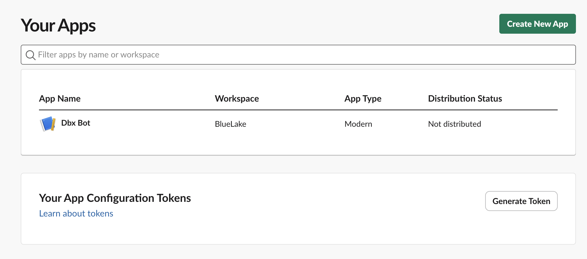
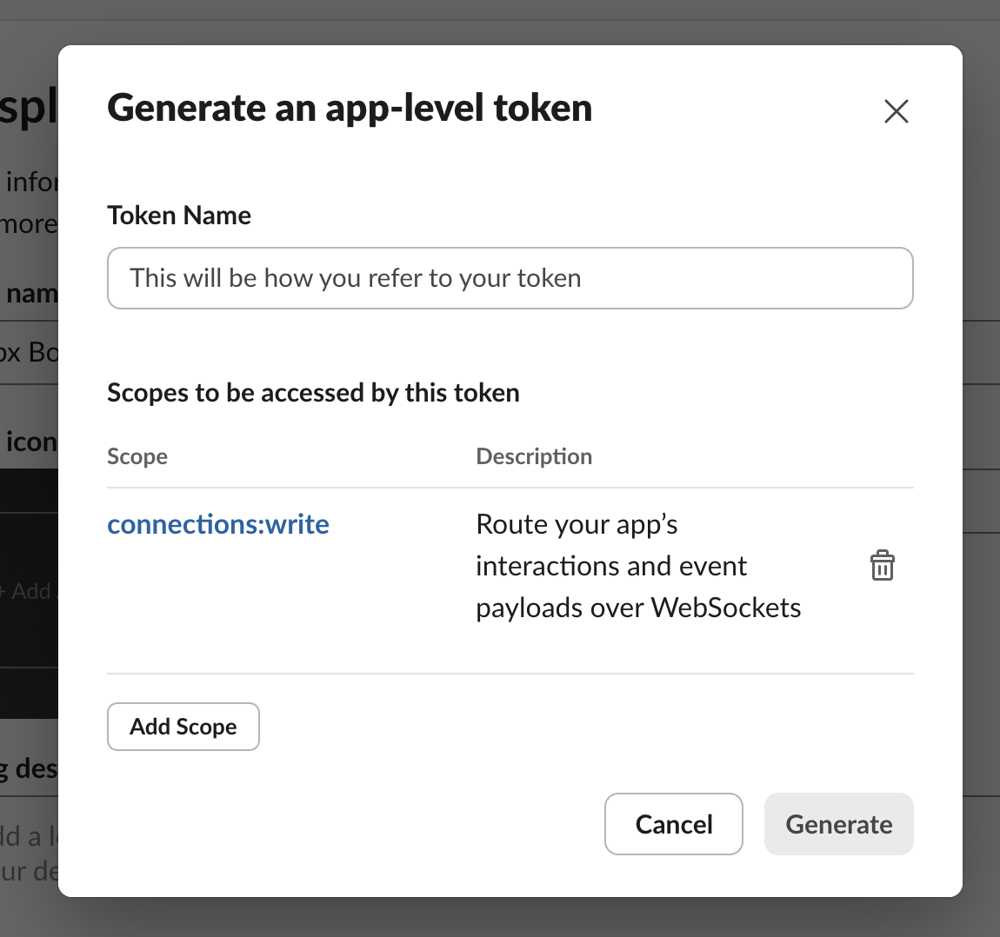
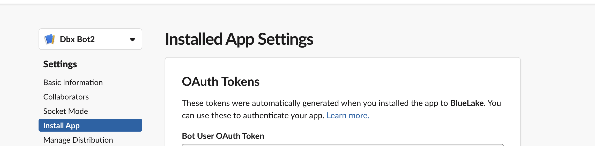

# Databricks App - Genie Bot on Slack

## This is a simple Genie Bot on Slack deployed on Databricks APP

This repository builds upon the [Databricks Slack Bot](https://github.com/alex-lopes-databricks/databricks_apps_collection/tree/main/slack-bot) by [Alex Lopes](https://github.com/alex-lopes-databricks), enabling users to deploy a Slack app directly within Databricks Apps. The main enhancement is seamless integration with Databricks Genie, allowing users to interact with Genie through Slack. </br></br>


# How to get started
* Install databricks cli and configure your workspace authentication see here: https://docs.databricks.com/en/dev-tools/cli/install.html
* Create a slack app - Steps Below
* Create your app: ```databricks apps create slack-bot```
* Sync the files with the workspace: ```databricks sync --watch . /Workspace/Users/<username>/App/slack-bot``` (you can keep this command in a side window if you want to sync continously)
* Use the notebook under the folder  ```/Workspace/Users/<username>/App/slack-bot``` create secrets and store the slack credentials securely execute the first line after the widgets are created enter the values of the secrets to be stored - make sure these values are removed from the widgets later
* Deploy: ```databricks apps deploy slack-bot --source-code-path=/Workspace/Users/<username>/App/slack-bot ```
* Look for your bot in slack and send a message

# How to create a slack app and get credentials

* Create a slack account if you do not have one, also in the process you can choose to create a slack workspace for testing it has free options: https://slack.com/help/articles/206845317-Create-a-Slack-workspace
* In your account look for the apps page and select create new app: 
<p align="center">
     </br>
</p>
</br>

* Use the json manifest file contained in this project and customize with your application name if needed
* In the main page after the app is created (Basic Information Menu) scroll down and click to generate an App level token select the option "connections:write" and click generate the token will be displayed save it and use it in the process of creating secrets:

 </br>

* On the left panel select the option install App select the workspace you want your app installed after it is installed a bot user token will be displayed save it and use in the secrets process:
